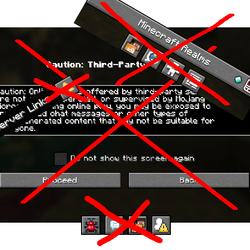

# Bye Bye Buttons

---

This mod removes all unwanted buttons from Minecraft.

This mod is plug-and-play. No configuration is required.
Every button (except for the option buttons) has another way to access its functionality, e.g. keybinds.

## Removed Buttons
- Realms button (title screen)
- Friends button (title screen)
- Language button (title screen)
- Accessibility button (title screen)
- Bug report button (pause screen)
- Feedback button (pause screen)
- Friends button (pause screen)
- Player reporting button (pause screen)
- Telemetry Data button (options)
- Credits & Attribution button (options)
- Multiplayer warning (when navigating from title screen to multiplayer screen)
- The warning button for custom dialogs (replaced with a simple text label)
- Cancel button (beacon screen)